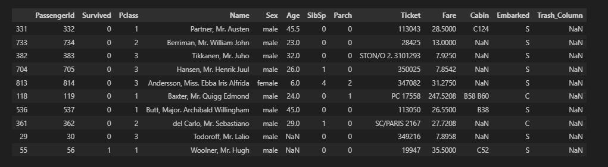
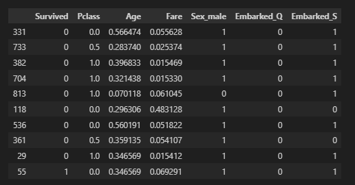

# DataPreprocessor
Класс для базовой предобработки табличных данных на Python с использованием pandas. Спроектирован с учетом разделения этапов обучения (fit) и трансформации (transform), что предотвращает утечку данных (Data Leakage) при работе с обучающей и тестовой выборками.

## Основные возможности:
 1. Класс запоминает параметры (медианы, средние, границы MinMax) на тренировочных данных и применяет их к новым данным.
 2. Защита от ошибок:
   * Автоматическая обработка деления на 0 при нормализации.
   * Исключение бинарных признаков из процесса масштабирования (сохранение интерпретируемости).
   * Обработка отсутствующих категорий в тестовой выборке через выравнивание индексов.

## Технологии:
- Python 3.13;
- Pandas, NumPy, SciKit-Learn;

## Структура проекта
```
1.  data_preprocessor.py   # Исходный код класса DataPreprocessor
2.  notebook.ipynb         # Демонстрация работы на датасете Titanic
3.  requirements.txt       # Зависимости (pandas, numpy, scikit-learn)
4.  README.md              # Документация проекта
```

## Методы класса
 Методы /  Описание /  Параметры 

> remove_missing. Удаляет колонки с пропусками выше threshold и заполняет остальные. threshold (0-1), strategy (mean/median/mode) 

> normalize_numeric. Приводит числа к единому масштабу. method ('minmax' или 'std')   

> encode_categorical. Превращает текст в One-Hot векторы.  - 

> fit_transform. Запускает полный цикл обработки. Те же, что выше 

> transform. Применяет сохраненные правила к новому DF. df (pandas DataFrame) 

## Быстрый старт
Клонируйте репозиторий:
 ```
   git clone https://github.com/Nika-Grets/DataPreprocessor.git
   cd DataPreprocessor 
```

Убедитесь, что установлены необходимые библиотеки:
```
pip install -r requirements.txt
``` 

### Демонстрация
В репозитории представлен файл DataPreprocessor.ipynb. В нем продемонстрирована работа класса на общедоступном датасете Titanic.
До обработки данные содержат пропуски в age, cabin и текстовые категории. После обработки данные полностью очищены, нормализованы и готовы для подачи в модель машинного обучения.

В случае портов (C, Q и S) достаточно двух колонок, чтобы однозначно определить порт, если embarked_q = 0 и embarked_s = 0, то методом исключения это значит, что человек сел в порту C.

#### Масштабирование данных
Класс поддерживает два режима масштабирования:

- **Min-Max (`method='minmax'`)**: Линейное преобразование данных в диапазон `[0, 1]`. 
- **Standardization (`method='std'`)**: Z-score стандартизация. 
  Данные центрируются относительно **среднего значения (0)**. ​В результате этой математической операции среднее значение вашего набора данных становится равным 0. ​Числа с минусом - это те значения, которые в исходном наборе были меньше среднего. Минус показывает направление «ниже нормы». ​Числа без минуса (положительные) - значения, которые были больше среднего. Значения в диапозоне от -3.0 до 3.0.


## Примеры

​На вход был подан необработанный датасет, создан столбец, содержащий все NaN, столбец cabin заполнен менее чем на 30%, в столбце age есть пропуски, категориальные признаки (sex, embarked) представлены в текстовом виде.

> Данные до обработки:
  

​Класс выполнил следующие шаги:
Столбец deck удален автоматически, так как процент пропусков выше порога 0.5, пропуски в age заполнены медианой, в embarked модой, текстовые признаки преобразованы в числовые, применена норомализация/стандартизация.

>  Этапы:
  

В результате данные готовы для работы, все значения числовые а дипазоне от 0 до 1 и не имеют пропусков.

>  Min-Max:
  

>    

>  Standardization:
  

### Обработка исключений
Класс валидирует входные данные и выбрасывает понятные ошибки:
 1. TypeError. Если на вход подан не DataFrame.
 2. ValueError. При некорректных параметрах (например, threshold=1.5).
 3. RuntimeError. При попытке вызвать transform раньше, чем fit.

### Возможные пути развития
 1. Интеграция с polars для ускорения обработкина больших данных.
 2. Добавление метода для автоматической обработки выбросов.
 3. Поддержка разреженных матриц для оптимизации памяти при One-Hot кодировании.